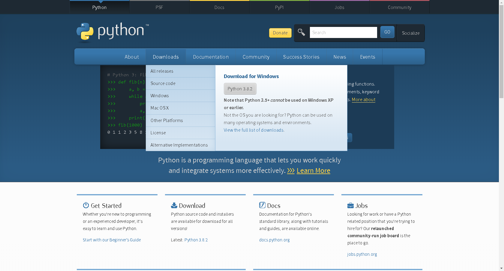
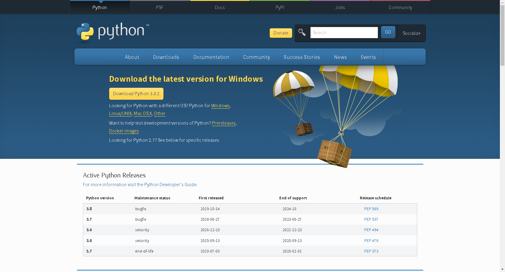
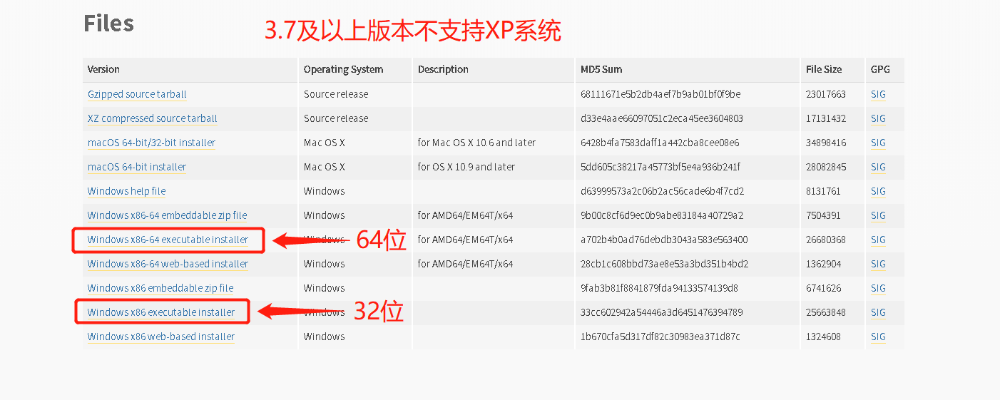
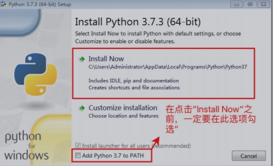
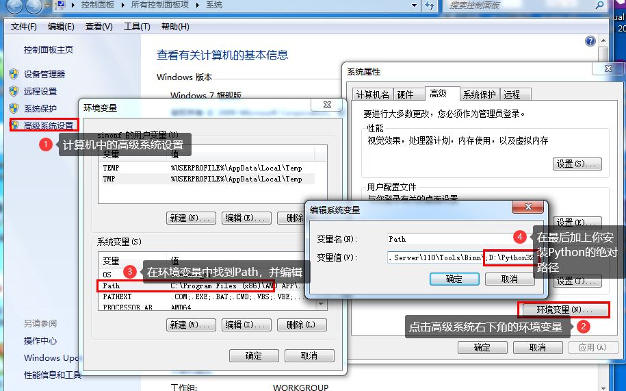

# Python每日一讲--Python安装

## 安装Python及配置环境

- Python最新源码，解释器环境等最新下载 

  Python官网:http://www.python.org/ 

- Python 权威使用技术文档等最新下载 

  Python文档下载地址:http://www.python.org/doc/

  

## windows & Mac

首先访问http://www.python.org/download/ 下载最新环境(根据自身系统选择不同版本)



然后选择合适的版本(推荐使用3.7.4)，并适用于自己系统的环境

推荐使用安装包安装



下载后，双击安装,选择“Install Now”默认安装，但一定勾选“Add Python 3.7 toPATH”

Python3.7及以上版本在勾选后可以自动添加环境至系统的环境变量



如果没有添加环境，在安装之后，配置环境



## Unix & Linux 平台安装 Python:(源码式安装)

- 以下为在Unix & Linux 平台上安装 Python 的简单步骤：
  - 打开WEB浏览器访问http://www.python.org/download/
  - 选择适用于Unix/Linux的源码压缩包。
  - 下载及解压压缩包。
  - 如果你需要自定义一些选项修改Modules/Setup
  - 执行 ./configure 脚本
  - make
  - make install
- 执行以上操作后，Python会安装在 /usr/local/bin 目录中，Python库安装在/usr/local/lib/pythonXX，XX为你使用的Python的版本号。

## Python测试运行

**windows下：**

运行cmd进入到命令行窗口，运行语句python --version，显示出Python对应版本则表示安装成功

```cmd
C:\Users\hq0749a>python --version
Python 3.7.4
```

